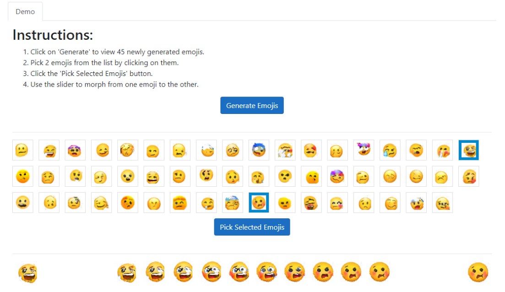
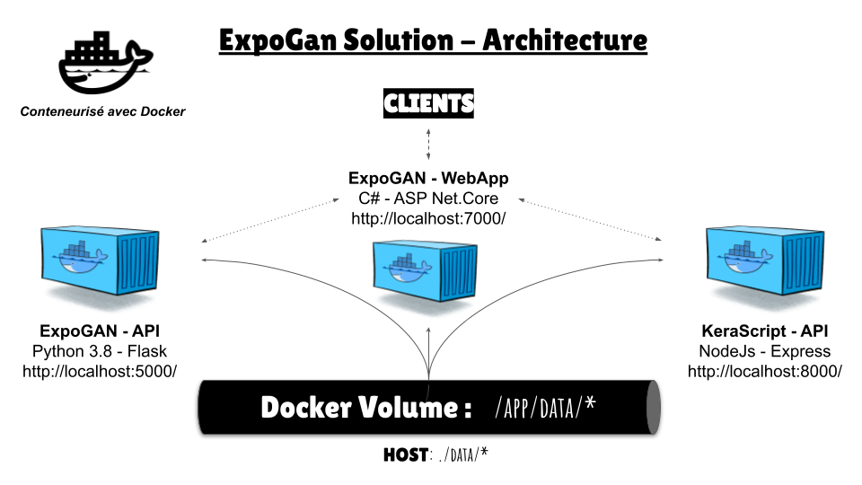

# Build & Run W/O Docker

## Interface

## Architecture

## Dependencies without docker

* pip3 install flask-session matplotlib sklearn numpy requests pandas scipy pickle5

## Run

* export FLASK_APP=main.py  
* flask run

# Build & Run with Docker

## Adminer Setup

Make sure that you have a .env file at the root of this repo.  
This .env file must contains the following credentials :  
`POSTGRES_USER=shifumeister`  
`POSTGRES_PASSWORD=adminer`  
`DATABASE_URL=Host=expogan.data;Database=expogan;Username=shifumeister;Password=adminer`  

## Docker setup

* [Install docker](https://docs.docker.com/get-docker/)
* [Install docker compose](https://docs.docker.com/compose/install/)

## Run

* cd in the root of this repo
* sudo docker-compose build
* sudo docker-compose up
* Go to localhost:5000/ to have our test API app
* Go to localhost:7000/ to have our web app
